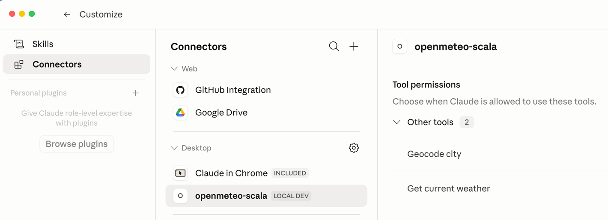

# OpenMeteo MCP Server in Scala 3

A local Model Context Protocol server written in Scala 3 exposes selected Open-Meteo web API operations as MCP tools that can be used by Claude Desktop, Claude Code, or another MCP-compatible client.

The project demonstrates how an external web microservice can be wrapped as a typed MCP server. Claude does not inspect the Scala JAR, does not reflect on Scala methods, and does not call Scala functions directly. Claude discovers named MCP tools through the MCP protocol, decides which tool to invoke from the tool names, descriptions, schemas, and user request, and then sends a JSON-RPC `tools/call` request. The Scala server maps that tool name to a Scala handler function.

[](LICENSE)

## What this project demonstrates

- How to expose an external HTTP microservice to an LLM through MCP.
- How to write a local stdio MCP server in Scala 3.
- How to define MCP tools using names, descriptions, input schemas, and output schemas.
- How Claude chooses tools from the metadata returned by `tools/list`.
- How the Scala server dispatches MCP tool calls to internal Scala functions.
- How to connect the server to Claude Desktop.
- How to connect the server to Claude Code.
- How to package the server as a runnable JAR with sbt-assembly.

## External service

This project uses [Open-Meteo](https://open-meteo.com/). Open-Meteo provides weather APIs over HTTP GET with JSON responses. The example server uses the following components.

- Open-Meteo Geocoding API;
- Open-Meteo Forecast API with current weather variables.

The default implementation exposes two tools.

- `geocode_city`
- `get_current_weather`

Open-Meteo free API usage is subject to Open-Meteo terms. At the time this README was written, the free API is intended for non-commercial use, has rate limits, and the data is provided under the CC BY 4.0 data license. Check the current Open-Meteo terms before publishing or deploying this project.

Useful links include the following.

- Open-Meteo home: https://open-meteo.com/
- Open-Meteo terms: https://open-meteo.com/en/terms
- Open-Meteo API docs: https://open-meteo.com/en/docs
- Open-Meteo geocoding API: https://open-meteo.com/en/docs/geocoding-api
- CC BY 4.0: https://creativecommons.org/licenses/by/4.0/

## MCP background

_Model Context Protocol (MCP)_ server exposes capabilities to an MCP client. For this project, the important capability is `tools`. The MCP flow is the following.
```text
Claude Desktop or Claude Code
  starts the JAR as a subprocess
  sends JSON-RPC over stdin
  reads JSON-RPC over stdout

Scala MCP server
  reads one JSON-RPC message per line
  answers initialize
  answers tools/list
  answers tools/call
  calls Open-Meteo over HTTP
  returns structured MCP tool results
```

The MCP server is local and uses stdio transport. It is **not** an HTTP server and does not listen on a port.

## Architecture

```text
User prompt
  |
  v
Claude
  |
  | MCP JSON-RPC over stdio
  v
OpenMeteoMcpServer.scala
  |
  | Java HttpClient over HTTPS
  v
Open-Meteo APIs
```

The critical mapping is the following.

```text
MCP tool name: geocode_city
  -> Scala ToolDef named geocodeCityTool
  -> Scala handler function geocodeCity

MCP tool name: get_current_weather
  -> Scala ToolDef named currentWeatherTool
  -> Scala handler function getCurrentWeather
```

Claude sees the following information:

```text
tool name
tool title
tool description
input schema
output schema
server instructions
```

and Claude does not see this information:

```text
Scala source code
Scala method names
Scala private functions
JAR bytecode internals
```

## Repository structure

The layout for the project is the following.

```text
openmeteo-mcp/
  README.md
  LICENSE
  .gitignore
  build.sbt
  project/
    plugins.sbt
  src/
    main/
      scala/
        OpenMeteoMcpServer.scala
```

Optional future layout:

```text
openmeteo-mcp/
  src/
    main/
      scala/
          mcp/
            JsonRpc.scala
            ToolDef.scala
            McpServer.scala
          openmeteo/
            OpenMeteoClient.scala
            OpenMeteoTools.scala
          OpenMeteoMcpServer.scala
    test/
      scala/
         OpenMeteoMcpServerSpec.scala
```

The current project keeps everything in one file for clarity. That is useful for teaching and for understanding the protocol. For a larger project, split protocol handling, HTTP client logic, tool definitions, and tests.

## Requirements

- JDK 17 or newer
- sbt
- Scala 3
- Claude Desktop or Claude Code
- Internet access to call Open-Meteo APIs

Check Java:

```bash
java -version
```

Check sbt:

```bash
sbt --version
```

## Build files

`project/plugins.sbt`:

```scala
addSbtPlugin("com.eed3si9n" % "sbt-assembly" % "2.3.1")
```

`build.sbt`:

```scala
ThisBuild / scalaVersion := "3.8.3"
ThisBuild / version := "0.1.0"
ThisBuild / organization := "Lone Star Consulting, Inc."

lazy val root = (project in file("."))
  .settings(
    name := "openmeteo-mcp",

    libraryDependencies += "com.lihaoyi" %% "ujson" % "4.4.3",

    Compile / mainClass := Some("OpenMeteoMcpServer"),
    assembly / mainClass := Some("OpenMeteoMcpServer"),
    assembly / assemblyJarName := "openmeteo-mcp.jar"
  )
```

If you use a different Scala version, the generated target directory will change. For example:

```text
target/scala-3.8.3/openmeteo-mcp.jar
target/scala-3.3.7/openmeteo-mcp.jar
```

Use the path that exists on your machine.

## Build the runnable JAR

From the project root:

```bash
sbt clean assembly
```

Expected output:

```text
target/scala-3.8.3/openmeteo-mcp.jar
```

Verify:

```bash
ls -l target/scala-3.8.3/openmeteo-mcp.jar
```

If the Scala target directory is different:

```bash
find target -name "openmeteo-mcp.jar" -print
```

## Smoke test without Claude

Run this from the project root. Adjust the JAR path if needed.

```bash
printf '%s\n' \
'{"jsonrpc":"2.0","id":1,"method":"initialize","params":{"protocolVersion":"2025-11-25","capabilities":{},"clientInfo":{"name":"test-client","version":"0.1.0"}}}' \
'{"jsonrpc":"2.0","method":"notifications/initialized"}' \
'{"jsonrpc":"2.0","id":2,"method":"tools/list","params":{}}' \
'{"jsonrpc":"2.0","id":3,"method":"tools/call","params":{"name":"geocode_city","arguments":{"city":"Chicago","count":3}}}' \
| java -jar target/scala-3.8.3/openmeteo-mcp.jar
```

You should see JSON-RPC responses for:

```text
initialize
tools/list
tools/call
```

The `notifications/initialized` message is a notification, so the server should not emit a response for it.

A successful `tools/list` response should include:

```text
geocode_city
get_current_weather
```

## Configure Claude Desktop

Claude Desktop on macOS reads local MCP server configuration from its default configuration file on Mac OS.

```text
~/Library/Application Support/Claude/claude_desktop_config.json
```

Example configuration is the following.

```json
{
  "mcpServers": {
    "openmeteo-scala": {
      "type": "stdio",
      "command": "java",
      "args": [
        "-jar",
        "/Root/path/to/openmeteo-mcp/target/scala-3.8.3/openmeteo-mcp.jar"
      ],
      "env": {}
    }
  }
}
```

If your current config already has a `preferences` object, keep it and add `mcpServers` at the top level:

```json
{
  "preferences": {
    "remoteToolsDeviceName": "lisbon-local",
    "coworkWebSearchEnabled": true,
    "coworkScheduledTasksEnabled": true,
    "ccdScheduledTasksEnabled": true,
    "epitaxyPrefs": {
      "starred-local-code-sessions": [],
      "starred-cowork-spaces": [],
      "starred-session-groups": [],
      "dframe-local-slice": {
        "pinnedOrder": [],
        "customGroupAssignments": {},
        "customGroupOrder": {}
      }
    }
  },
  "mcpServers": {
    "openmeteo-scala": {
      "type": "stdio",
      "command": "java",
      "args": [
        "-jar",
        "/Root/path/to/openmeteo-mcp/target/scala-3.8.3/openmeteo-mcp.jar"
      ],
      "env": {}
    }
  }
}
```

After editing the config, fully quit and restart Claude Desktop using the commands below.

```bash
osascript -e 'quit app "Claude"'
open -a Claude
```

Then ask Claude Desktop the following prompt request.

```text
List the tools exposed by the openmeteo-scala MCP server.
```

Or this one.

```text
Use the openmeteo-scala MCP server. Find the current weather in Chicago.
```

If Claude says the MCP server is not installed, check that `mcpServers` is present in `claude_desktop_config.json`, the JAR path is absolute, and the JAR exists.

## Configure Claude Code

Claude Code uses its own MCP configuration. The Claude Code CLI command does not automatically modify the Claude Desktop config file.

Add the local stdio server to Claude Code.

```bash
claude mcp add-json openmeteo-scala \
'{"type":"stdio","command":"java","args":["-jar","/Users/drmark/IdeaProjects/openmeteo-mcp/target/scala-3.8.3/openmeteo-mcp.jar"],"env":{}}'
```

Verify if the command executed successfully.

```bash
claude mcp get openmeteo-scala
claude mcp list
```

Inside Claude Code, use the command

```text
/mcp
```
to obtain available connectors as seen below.


If you want a project-scoped configuration for GitHub publishing, use a `.mcp.json` file at the project root. Example:

```json
{
  "mcpServers": {
    "openmeteo-scala": {
      "type": "stdio",
      "command": "java",
      "args": [
        "-jar",
        "${CLAUDE_PROJECT_DIR:-.}/target/scala-3.8.3/openmeteo-mcp.jar"
      ],
      "env": {}
    }
  }
}
```

Do not commit secrets into `.mcp.json`.

## Tools exposed by the server
The Scala handler is named differently from the MCP tool name because they live in two different worlds. The MCP tool name is the public semantic name exposed to Claude as part of the protocol contract. Claude sees names like the following.

```scala
geocode_city
get_current_weather
```

So the underscore acts as a word boundary that helps Claude infer the tool’s meaning. The Scala handler is the private implementation function inside the JAR. The Scala compiler sees names as we chose them for our implementation.

```scala
geocodeCity
getCurrentWeather
```

Claude does not know about `geocodeCity`. It only knows about `geocode_city`. The connection exists only because the `ToolDef` explicitly binds them.

```scala
ToolDef(
  name = "geocode_city",
  description = "Resolve a city or postal-code search string to candidate WGS84 coordinates.",
  inputSchema = ...,
  outputSchema = ...,
  handler = geocodeCity
)
```

So the mapping is the following.

```text
Claude calls MCP tool geocode_city
Scala dispatcher finds geocode_city in toolsByName
Scala invokes handler geocodeCity
```

They are named differently because each name follows the convention of its layer. Scala methods normally use lower camel case, so `geocodeCity` is idiomatic Scala. MCP tool names are JSON protocol names intended for LLMs, clients, logs, schemas, and tool registries, so lowercase snake case is clearer and more portable. In short, `geocodeCity` is for Scala developers; `geocode_city` is for Claude. So geocode_city is just a key in a map. No mystical AI incense involved.

Therefore, the tool name was chosen as `geocode_city` because it is short, precise, and action oriented. It says exactly what the tool does: it geocodes a city. More specifically, it converts a human place name like Chicago into machine usable coordinates like latitude, longitude, and timezone. That matters because the next tool, `get_current_weather`, does not accept a city name. It accepts coordinates. So Claude can infer the following chain.

```text
User asks for weather in Chicago
Chicago is a city name
get_current_weather needs latitude and longitude
geocode_city can produce latitude and longitude
Call geocode_city first
Then call get_current_weather
```

That is why the tool is not named using some vague words shown below.

```text
location
lookup
api_call
run
helper
method1
```

Those names are useless to an LLM because they force the model to guess. A good tool name should encode the domain operation directly: `geocode_city` is good because it tells Claude what problem the tool solves and `get_current_weather` is good because it tells Claude that the result is current, not historical and not a forecast.

There is also a design reason to keep the names separate. The MCP tool name is a stable public API. The Scala handler name is an implementation detail. You could refactor the handler from `geocodeCity` to `resolvePlaceName` or move it into another class, and Claude would not care as long as the MCP tool name remains `geocode_city`. That is the right separation. Public semantic contract outside, private implementation inside.

The naming rule is therefore simple.

```text
Tool name should be optimized for the LLM.
Handler name should be optimized for Scala code.
```

For this project, the best pattern is the following.

```text
MCP tool name
verb_object or verb_domain_object
lowercase snake case
clear to a model and a human reader

Scala handler name
lower camel case
idiomatic Scala
clear to the programmer
```

Examples include but not limited to the following.

```text
geocode_city maps to geocodeCity
get_current_weather maps to getCurrentWeather
search_flights maps to searchFlights
rank_trip_options maps to rankTripOptions
create_booking_hold maps to createBookingHold
```

To summarize, Claude does not invoke Scala methods, it invokes carefully named semantic tools. Your Scala code decides which method implements each tool. That separation is exactly what makes MCP useful instead of turning the JAR into a haunted house of accidental method calls.


## Tool: geocode_city

Purpose of this tool.

```text
Resolve a city, place name, or postal code into candidate WGS84 coordinates.
```

MCP name is chosen to reflect the function and be readable.

```text
geocode_city
```

Scala handler is the implementation.

```text
geocodeCity
```

Input arguments are listed below.

```json
{
  "city": "Chicago",
  "count": 3
}
```

Output shape is specified in the following JSON example.

```json
{
  "query": "Chicago",
  "matches": [
    {
      "name": "Chicago",
      "country": "United States",
      "admin1": "Illinois",
      "latitude": 41.85003,
      "longitude": -87.65005,
      "timezone": "America/Chicago"
    }
  ]
}
```

The output is intentionally smaller than the full upstream Open-Meteo response. This helps Claude chain tool calls without dumping unnecessary JSON into the model context.

## Tool: get_current_weather

Purpose:

```text
Get current temperature, wind speed, and weather code for WGS84 coordinates.
```

MCP name:

```text
get_current_weather
```

Scala handler:

```text
getCurrentWeather
```

Input arguments:

```json
{
  "latitude": 41.85003,
  "longitude": -87.65005,
  "timezone": "America/Chicago"
}
```

Output shape:

```json
{
  "latitude": 41.8756,
  "longitude": -87.6244,
  "timezone": "America/Chicago",
  "current": {
    "time": "2026-05-24T13:00",
    "temperature_2m": 72.1,
    "wind_speed_10m": 9.2,
    "weather_code": 2
  }
}
```

Weather values are examples. Actual values depend on Open-Meteo responses at runtime.

## How Claude knows what to call

Claude does not inspect the JAR.

Claude does not know that the Scala method `geocodeCity` exists.

Claude sees only the MCP metadata returned from `tools/list`.

The server advertises tools using this abstraction.

```scala
final case class ToolDef(
    name: String,
    title: String,
    description: String,
    inputSchema: Value,
    outputSchema: Value,
    handler: Obj => Value
)
```

The MCP-visible part is

```text
name
title
description
inputSchema
outputSchema
```

The Scala-only part is

```text
handler
```

Consider the following example.

```scala
ToolDef(
  name = "geocode_city",
  title = "Geocode city",
  description =
    "Resolve a city or postal-code search string to candidate WGS84 coordinates using Open-Meteo geocoding.",
  inputSchema = ...,
  outputSchema = ...,
  handler = geocodeCity
)
```

Claude sees the commands below.

```text
geocode_city
Resolve a city or postal-code search string to candidate WGS84 coordinates.
```

The Scala server keeps the following mapping.

```text
geocode_city -> geocodeCity
```

The actual dispatcher is shown below.

```scala
toolsByName.get(toolName) match
  case Some(tool) => tool.handler(args)
  case None       => toolError(s"Unknown tool: $toolName")
```

So the real mapping is illustrated below.

```text
User query
  -> Claude chooses MCP tool from name, description, and schema
  -> Claude sends tools/call with tool name and JSON arguments
  -> Scala server looks up that tool name in toolsByName
  -> Scala server calls the handler function
```

Example user prompt:

```text
What is the current weather in Chicago?
```

Claude sees that:

```text
get_current_weather requires latitude and longitude
geocode_city accepts a city string and returns latitude and longitude
```

So Claude can infer the following plan.

```text
Call geocode_city with city = Chicago
Read latitude and longitude from the result
Call get_current_weather with those coordinates
Summarize the weather result
```

## Code structure

The current implementation is intentionally compact and keeps the protocol logic, tool definitions, and HTTP wrappers in one file.

```text
src/main/scala/OpenMeteoMcpServer.scala
```

Main sections of the implementation are the following.

```text
ProtocolVersion
  The MCP protocol version string used by initialize.

httpClient
  Shared Java HttpClient instance.

ToolDef
  Internal Scala representation of an MCP tool.

main
  Starts the stdio loop.

handleLine
  Parses each JSON-RPC message and dispatches by method name.

send
  Writes a compact JSON-RPC response to stdout.

response
  Wraps a successful JSON-RPC result.

error
  Wraps a JSON-RPC protocol error.

initializeResult
  Answers the MCP initialize request.

geocodeCityTool
  MCP metadata plus Scala handler for geocoding.

currentWeatherTool
  MCP metadata plus Scala handler for current weather.

tools
  List of tools exposed by this server.

toolsByName
  Dispatch table from MCP tool name to Scala ToolDef.

listToolsResult
  Builds the response for tools/list.

callTool
  Handles tools/call and invokes the selected handler.

geocodeCity
  Validates city input and calls the Open-Meteo geocoding API.

getCurrentWeather
  Validates coordinates and calls the Open-Meteo forecast API.

httpGetJson
  Performs the upstream HTTP GET and parses JSON.

toolSuccess
  Builds an MCP tool result with content and structuredContent.

toolError
  Builds an MCP tool result with isError = true.

requiredString
  Reads and validates required string arguments.

requiredDouble
  Reads and validates required numeric arguments.

optionalString
  Reads optional string arguments.

optionalInt
  Reads optional integer arguments.

locationSummary
  Normalizes Open-Meteo geocoding results.

jsonStr
  Safely extracts a JSON string field.

jsonNum
  Safely extracts a JSON numeric field.

urlEncode
  Encodes query parameter values.
```

## Protocol flow

A typical MCP session looks like the following.

```text
Claude Desktop starts:
  java -jar openmeteo-mcp.jar

Claude sends:
  initialize

Server responds:
  protocolVersion
  capabilities.tools
  serverInfo
  instructions

Claude sends:
  notifications/initialized

Claude sends:
  tools/list

Server responds:
  geocode_city
  get_current_weather

User asks:
  What is the current weather in Chicago?

Claude sends:
  tools/call geocode_city

Server runs:
  geocodeCity(args)

Server calls:
  Open-Meteo geocoding API

Server returns:
  latitude
  longitude
  timezone

Claude sends:
  tools/call get_current_weather

Server runs:
  getCurrentWeather(args)

Server calls:
  Open-Meteo forecast API

Server returns:
  current weather JSON

Claude answers the user.
```

To understand the machinery behind the scene, consider the command `initialize`. The MCP server knows how to respond because we explicitly programmed it to recognize the JSON RPC method named `initialize`. There is no automatic discovery and no magic. Claude sends a JSON RPC message that looks roughly like the following.

```json id="fiqf01"
{
  "jsonrpc": "2.0",
  "id": 1,
  "method": "initialize",
  "params": {
    "protocolVersion": "2025-11-25",
    "capabilities": {},
    "clientInfo": {
      "name": "Claude Desktop",
      "version": "..."
    }
  }
}
```

Our Scala server reads that line from stdin.

```scala id="t50qbn"
for line <- source.getLines() do
  val trimmed = line.trim
  if trimmed.nonEmpty then handleLine(trimmed)
```

Then `handleLine` parses the JSON.

```scala id="7k9mhc"
val msg = ujson.read(line)
val obj = msg.obj

val idOpt: Option[Value] = obj.get("id")
val method: String =
  obj.get("method").collect { case Str(s) => s }.getOrElse("")
```

At this point the server has extracted the method information.

```text id="pe1lwz"
id = 1
method = initialize
```

Then the pattern match decides what to do.

```scala id="9aj89k"
method match
  case "initialize" =>
    idOpt.foreach(id => send(response(id, initializeResult(msg))))

  case "notifications/initialized" =>
    ()

  case "ping" =>
    idOpt.foreach(id => send(response(id, Obj())))

  case "tools/list" =>
    idOpt.foreach(id => send(response(id, listToolsResult())))

  case "tools/call" =>
    idOpt.foreach { id =>
      val result = callTool(msg)
      send(response(id, result))
    }

  case other =>
    idOpt.foreach(id => send(error(id, -32601, s"Method not found: $other")))
```

So when Claude sends the command `initialize`

```text id="yxi01a"
method = initialize
```

our server runs the following method.

```scala id="p0rmfb"
initializeResult(msg)
```

Then the MCP server wraps that result into a JSON RPC response using the same request id.

```scala id="qk3zph"
response(id, initializeResult(msg))
```

The wrapper function is the following.

```scala id="r9ord4"
private def response(id: Value, result: Value): Value =
  Obj(
    "jsonrpc" -> "2.0",
    "id" -> id,
    "result" -> result
  )
```

So if Claude sent id 1, our MCP server answers with id 1. That is how Claude knows which response belongs to which request.

The real content of the initialize answer is built as shown below.

```scala id="sbpzih"
private def initializeResult(msg: Value): Value =
  val requested =
    Try(msg("params")("protocolVersion").str).getOrElse(ProtocolVersion)

  val negotiated =
    if requested == ProtocolVersion then requested else ProtocolVersion

  Obj(
    "protocolVersion" -> negotiated,
    "capabilities" -> Obj(
      "tools" -> Obj(
        "listChanged" -> false
      )
    ),
    "serverInfo" -> Obj(
      "name" -> "openmeteo-scala-mcp",
      "title" -> "Open-Meteo Scala MCP Server",
      "version" -> "0.1.0"
    ),
    "instructions" ->
      "Use geocode_city to convert a place name into coordinates, then use get_current_weather."
  )
```

Doing so tells Claude four important things. First, the protocol version

```json id="u20fh4"
"protocolVersion": "2025-11-25"
```

instructing which MCP protocol version the server claims to support.

Second, the server capabilities

```json id="wwlcsg"
"capabilities": {
  "tools": {
    "listChanged": false
  }
}
```

instructing Claude using the information below.

```text id="ijvtdi"
This server supports tools.
The tool list is not expected to change dynamically.
```

That is why Claude later sends the following tools command.

```text id="qzrrhl"
tools/list
```

If the server did not advertise tools, Claude would have no reason to ask for tool definitions.

Third, server identity 

```json id="s2gc7k"
"serverInfo": {
  "name": "openmeteo-scala-mcp",
  "title": "Open-Meteo Scala MCP Server",
  "version": "0.1.0"
}
```

gives Claude and the host application metadata about the server.

Fourth, instructions

```json id="zpdprs"
"instructions": "Use geocode_city to convert a place name into coordinates, then use get_current_weather."
```

guide Claude through the intended workflow.

The actual response sent back to Claude looks roughly like the following.

```json id="wmuklw"
{
  "jsonrpc": "2.0",
  "id": 1,
  "result": {
    "protocolVersion": "2025-11-25",
    "capabilities": {
      "tools": {
        "listChanged": false
      }
    },
    "serverInfo": {
      "name": "openmeteo-scala-mcp",
      "title": "Open-Meteo Scala MCP Server",
      "version": "0.1.0"
    },
    "instructions": "Use geocode_city to convert a place name into coordinates, then use get_current_weather."
  }
}
```

Then `send` writes it to stdout.

```scala id="l4xbda"
private def send(v: Value): Unit =
  Console.out.println(ujson.write(v))
  Console.out.flush()
```

So the full flow is the following.

```text id="l4ca2s"
Claude writes initialize JSON to server stdin.
Scala reads one line from stdin.
Scala parses it as JSON.
Scala extracts method = initialize.
Scala matches case initialize.
Scala builds initializeResult.
Scala wraps it in a JSON RPC response with the same id.
Scala writes the response JSON to stdout.
Claude reads stdout and continues the MCP session.
```

The server knows how to respond only because of this explicit case.

```scala id="i6gcd9"
case "initialize" =>
  idOpt.foreach(id => send(response(id, initializeResult(msg))))
```

If you removed that case, Claude would send `initialize`, and your server would fall into the following error response.

```scala id="ngydxw"
case other =>
  idOpt.foreach(id => send(error(id, -32601, s"Method not found: $other")))
```

Then Claude would receive bupkis

```json id="41fpv6"
{
  "jsonrpc": "2.0",
  "id": 1,
  "error": {
    "code": -32601,
    "message": "Method not found: initialize"
  }
}
```

and the MCP connection would fail.

One important detail: the demo code is lenient about protocol negotiation.

```scala id="dmwzrq"
val negotiated =
  if requested == ProtocolVersion then requested else ProtocolVersion
```

That means if Claude asks for a different protocol version, the server still answers with its own preferred version. It is fine for a demo, but in production, we would be stricter. If the requested version is unsupported, you should return a proper initialization error instead of pretending everything is fine. Otherwise you get the classic distributed systems experience: both sides smile, shake hands, and then quietly betray each other later.

The short answer is shown below.

```text id="sm6uzb"
Claude sends initialize because MCP requires an initialization handshake.
Your server knows how to respond because handleLine pattern matches method = initialize.
initializeResult constructs the capabilities and metadata response.
send writes the JSON RPC response back to Claude over stdout.
```


## Why stdout and stderr matter

For stdio MCP servers:

```text
stdout is protocol output
stderr is logs
```

Good:

```scala
Console.err.println("server started")
```

Bad:

```scala
Console.out.println("server started")
```

Claude expects stdout to contain only valid JSON-RPC messages. Random logs on stdout can break the connection.

## Troubleshooting

Problem:

```text
Claude says the server is not installed.
```

Likely cause:

```text
Claude Desktop config does not contain mcpServers.
The server was registered in Claude Code, not Claude Desktop.
The JAR path is wrong.
Claude Desktop was not restarted.
```

Fix:

```bash
cat "$HOME/Library/Application Support/Claude/claude_desktop_config.json"
find /Users/drmark/IdeaProjects/openmeteo-mcp/target -name "openmeteo-mcp.jar" -print
osascript -e 'quit app "Claude"'
open -a Claude
```

Problem:

```text
sbt says: not found: value assembly
```

Likely cause:

```text
project/plugins.sbt is missing or placed under project/project/plugins.sbt.
```

Fix:

```bash
mkdir -p project
cat > project/plugins.sbt <<'EOF'
addSbtPlugin("com.eed3si9n" % "sbt-assembly" % "2.3.1")
EOF

sbt reload
sbt clean assembly
```

Problem:

```text
Claude sees the server but no tools.
```

Likely causes:

```text
tools/list failed.
initialize failed.
The server printed non-JSON text to stdout.
The JAR crashed on startup.
```

Check logs:

```bash
tail -n 100 "$HOME/Library/Logs/Claude/mcp.log"
tail -n 100 "$HOME/Library/Logs/Claude/mcp-server-openmeteo-scala.log"
```

Problem:

```text
tools/call returns invalid request.
```

Likely cause:

```text
The arguments do not match the expected input schema.
```

Make tool errors actionable. Good error:

```text
Missing required numeric argument: latitude. Use geocode_city first if the user supplied a city name.
```

Bad error:

```text
Bad request.
```

## Design rules for high-quality tool use

Claude's tool-use quality depends heavily on the semantic surface exposed by the MCP server.

Use precise tool names:

```text
Good:
  geocode_city
  get_current_weather
  search_flights
  create_invoice

Bad:
  run
  execute
  method1
  helper
  api_call
```

Use specific descriptions:

```text
Good:
  Resolve a city or postal-code search string to candidate WGS84 coordinates.

Bad:
  Gets data.
```

Use meaningful field names:

```text
Good:
  latitude
  longitude
  departure_airport
  return_date

Bad:
  x
  y
  arg1
  data
```

Use clear field descriptions:

```text
Good:
  Origin airport as a three-letter IATA code, for example ORD.

Bad:
  Origin.
```

Return normalized structured output. Do not dump giant upstream API responses into the model unless the model truly needs them.

Good output chaining:

```text
geocode_city returns latitude and longitude
get_current_weather accepts latitude and longitude
```

Bad output chaining:

```text
tool A returns a giant opaque blob
tool B expects fields hidden somewhere inside the blob
```

## Security model

This project exposes only read-only tools. The MCP server does not expose arbitrary Scala methods. Claude can call only tools advertised by `tools/list`.

Callable surface:

```scala
tools.map(_.name)
```

Not callable:

```text
private Scala functions that are not attached to a ToolDef
random methods inside the JAR
classes in dependencies
JVM internals
```

Security recommendations before adding write operations are the following.

```text
Validate every input argument.
Validate every structured output.
Use allowlisted upstream domains.
Set HTTP timeouts.
Add rate limits.
Log to stderr, not stdout.
Never expose secrets as tool arguments.
Store API tokens in environment variables.
Use human confirmation for mutating tools.
Use human confirmation for financial or irreversible actions.
Redact sensitive data from logs.
Add OpenTelemetry tracing for production use.
```

## Extending the server

To add a new Open-Meteo tool follow the template below.

1. Create a Scala handler function.

Example:

```scala
private def getHourlyForecast(args: Obj): Value =
  ???
```

2. Create a `ToolDef`.

Example:

```scala
private lazy val hourlyForecastTool: ToolDef =
  ToolDef(
    name = "get_hourly_forecast",
    title = "Get hourly forecast",
    description = "Get hourly forecast variables for WGS84 coordinates.",
    inputSchema = Obj(
      "type" -> "object",
      "properties" -> Obj(
        "latitude" -> Obj("type" -> "number"),
        "longitude" -> Obj("type" -> "number")
      ),
      "required" -> Arr("latitude", "longitude"),
      "additionalProperties" -> false
    ),
    outputSchema = Obj(
      "type" -> "object",
      "properties" -> Obj(
        "hourly" -> Obj("type" -> "object")
      ),
      "required" -> Arr("hourly"),
      "additionalProperties" -> true
    ),
    handler = getHourlyForecast
  )
```

3. Add it to the tool list.

```scala
private lazy val tools: Seq[ToolDef] =
  Seq(geocodeCityTool, currentWeatherTool, hourlyForecastTool)
```

Rebuild the project.

```bash
sbt clean assembly
```

Restart Claude Desktop.

## From hand-written wrapper to generator

This project is a hand-written MCP adapter. The same pattern can be generated from an external web service description. Mapping is straightforward.

```text
OpenAPI operationId
  -> MCP tool name

OpenAPI summary and description
  -> MCP tool title and description

OpenAPI parameters and request body schema
  -> MCP inputSchema

OpenAPI response schema
  -> MCP outputSchema

HTTP operation
  -> Scala handler

HTTP error
  -> MCP tool result with isError = true
```

For production use, add a semantic annotation layer. OpenAPI tells you field syntax but often does not tell you enough semantics.

Example:

```text
String is syntax.
IATA airport code is semantics.

Number is syntax.
Latitude in WGS84 is semantics.

String is syntax.
OAuth user identifier is semantics.
```

Without semantic annotations, the LLM may compose structurally valid but semantically wrong calls.

## Testing to add

Recommended tests:

```text
initialize returns tools capability.
tools/list returns expected tools.
geocode_city rejects missing city.
geocode_city returns structuredContent.
get_current_weather rejects invalid latitude.
get_current_weather rejects invalid longitude.
tools/call rejects unknown tool name.
httpGetJson handles non-2xx upstream responses.
stdout contains only JSON-RPC responses.
stderr contains logs.
```

Recommended integration tests:

```text
Run the JAR.
Send initialize.
Send tools/list.
Call geocode_city for Chicago.
Use returned coordinates to call get_current_weather.
Verify structuredContent shape.
```

## Roadmap

Possible next steps:

```text
Split one-file implementation into protocol, client, tools, and app packages.
Add tests.
Add OpenTelemetry spans around every tool call and upstream HTTP call.
Add a generated OpenAPI-to-MCP compiler.
Add support for Streamable HTTP MCP transport.
Add Dockerfile.
Add GitHub Actions build.
Add release workflow.
Add dependency license report.
Add generated documentation for all exposed tools.
Add support for forecast, historical weather, and air quality tools.
```


# How the OpenMeteo MCP Server Works

This document explains how the OpenMeteo MCP server works internally. Claude Desktop or Claude Code starts the compiled JAR as a subprocess. The server does not expose an HTTP port and it communicates with Claude through standard input and standard output using JSON RPC messages as described above.

The most important design point is that Claude does not inspect the JAR and Claude does not scan Scala classes. Claude does not know that Scala methods such as geocodeCity or getCurrentWeather exist. Claude only knows about tools that the server advertises through the MCP tools/list response. The Scala code is therefore an adapter between two worlds.

```text
MCP world
  tool names
  tool descriptions
  JSON schemas
  JSON RPC messages

Scala world
  functions
  maps
  HTTP clients
  JSON parsing
  validation
  structured results
```

The critical bridge between these worlds is the ToolDef class.

## Overall architecture

The basic execution path is shown below.

```text
Claude Desktop or Claude Code
  starts java -jar openmeteo-mcp.jar
  sends MCP JSON RPC requests to stdin
  reads MCP JSON RPC responses from stdout

OpenMeteoMcpServer
  reads JSON RPC messages line by line
  handles initialize, tools/list, and tools/call
  maps MCP tool names to Scala handler functions
  calls Open Meteo APIs with Java HttpClient
  returns structured tool results to Claude
```

The application flow is shown below.

```text
User prompt
  |
  v
Claude
  |
  | MCP JSON RPC over stdio
  v
Scala 3 MCP server
  |
  | HTTPS request
  v
Open Meteo API
```

Claude performs semantic planning whereas the Scala server performs protocol handling, validation, dispatch, HTTP calls, and result normalization. Open Meteo provides the geocoding and weather data.

## The central idea

The server exposes tools, not Scala methods. For example, Claude sees this MCP tool name.

```text
geocode_city
```

The Scala server internally maps that tool to this Scala handler.

```text
geocodeCity
```

Claude sees this MCP tool name.

```text
get_current_weather
```

The Scala server internally maps that tool to this Scala handler.

```text
getCurrentWeather
```

The mapping is explicit, it is not discovered from bytecode, reflection, or class names. The key runtime chain is shown below.

```text
User query
  -> Claude chooses an MCP tool from names, descriptions, and schemas
  -> Claude sends tools/call with a tool name and JSON arguments
  -> Scala server looks up that tool name in toolsByName
  -> Scala server invokes the handler function stored in the ToolDef
  -> Handler calls Open Meteo
  -> Handler returns structuredContent to Claude
```

## The ToolDef abstraction

The central data structure is ToolDef.

```scala
final case class ToolDef(
    name: String,
    title: String,
    description: String,
    inputSchema: Value,
    outputSchema: Value,
    handler: Obj => Value
):
  def asJson: Value =
    Obj(
      "name" -> name,
      "title" -> title,
      "description" -> description,
      "inputSchema" -> inputSchema,
      "outputSchema" -> outputSchema
    )
```

A ToolDef has two parts. The first part is visible to Claude.

```text
name
title
description
inputSchema
outputSchema
```

The second part is visible only inside the Scala server.

```text
handler
```

The name, title, description, input schema, and output schema are sent to Claude when Claude asks for the list of tools. These fields tell Claude what the tool does, what arguments it expects, and what kind of result it returns.

The handler is a Scala function. It is not sent to Claude. It is the function that the server executes after Claude invokes a tool. This means Claude sees something like the following description.

```text
Tool name: geocode_city
Description: Resolve a city or postal-code search string to coordinates.
Input: city, count
Output: matches with latitude, longitude, and timezone
```

The Scala server internally keeps this mapping.

```text
geocode_city -> geocodeCity
```

That mapping is created by assigning the handler field.

## How geocode_city is defined

The geocode_city tool converts a city name or postal code into candidate geographic locations. A simplified version of the tool definition is shown below.

```scala
private lazy val geocodeCityTool: ToolDef =
  ToolDef(
    name = "geocode_city",
    title = "Geocode city",
    description =
      "Resolve a city or postal-code search string to candidate WGS84 coordinates using Open-Meteo geocoding.",
    inputSchema = Obj(
      "type" -> "object",
      "properties" -> Obj(
        "city" -> Obj(
          "type" -> "string",
          "description" -> "City, place name, or postal code to search for."
        ),
        "count" -> Obj(
          "type" -> "integer",
          "description" -> "Maximum number of matches to return.",
          "minimum" -> 1,
          "maximum" -> 10,
          "default" -> 5
        )
      ),
      "required" -> Arr("city"),
      "additionalProperties" -> false
    ),
    outputSchema = ...,
    handler = geocodeCity
  )
```

The important MCP name is shown below.

```text
geocode_city
```

Claude calls the Scala function shown below.

```text
geocodeCity
```

This is the internal Scala function that actually performs the work. Claude never directly calls geocodeCity. Claude calls geocode_city. The server receives the MCP tool call, looks up geocode_city in its tool table, finds the handler, and executes geocodeCity.

The input schema tells Claude that the tool accepts a required city argument and an optional count argument. The descriptions help Claude map words from the user request to tool arguments. If the user asks for weather in Chicago, Claude can infer that Chicago belongs in the city field.

## How get_current_weather is defined

The get_current_weather tool receives latitude and longitude and returns current weather information. A simplified version of the tool definition is shown below.

```scala
private lazy val currentWeatherTool: ToolDef =
  ToolDef(
    name = "get_current_weather",
    title = "Get current weather",
    description =
      "Get current temperature, wind speed, and weather code for WGS84 coordinates using Open-Meteo.",
    inputSchema = Obj(
      "type" -> "object",
      "properties" -> Obj(
        "latitude" -> Obj(
          "type" -> "number",
          "description" -> "WGS84 latitude.",
          "minimum" -> -90,
          "maximum" -> 90
        ),
        "longitude" -> Obj(
          "type" -> "number",
          "description" -> "WGS84 longitude.",
          "minimum" -> -180,
          "maximum" -> 180
        ),
        "timezone" -> Obj(
          "type" -> "string",
          "description" -> "Timezone for the response, for example auto or Europe/Berlin.",
          "default" -> "auto"
        )
      ),
      "required" -> Arr("latitude", "longitude"),
      "additionalProperties" -> false
    ),
    outputSchema = ...,
    handler = getCurrentWeather
  )
```

This tool has a different semantic role: it does not know how to resolve city names and it expects coordinates. That separation is intentional. The server exposes two small domain operations.

```text
geocode_city
  converts place names into coordinates

get_current_weather
  converts coordinates into weather data
```

Claude composes them. The Scala server executes them. For example, when the user asks for the weather in Chicago, Claude can infer the following plan.

```text
Call geocode_city with city = Chicago.
Use the latitude and longitude from the first result.
Call get_current_weather with those coordinates.
Summarize the returned weather data.
```

This is the basic compositional pattern.

## Tool registration inside the server

The server registers its tools by placing them in a sequence.

```scala
private lazy val tools: Seq[ToolDef] =
  Seq(geocodeCityTool, currentWeatherTool)
```

This sequence is the complete list of callable tools. If a function is not reachable from this list, Claude cannot call it. The MCP server also creates a map from tool names to tool definitions.

```scala
private lazy val toolsByName: Map[String, ToolDef] =
  tools.map(t => t.name -> t).toMap
```

This creates a dispatch table.

```text
geocode_city -> geocodeCityTool
get_current_weather -> currentWeatherTool
```

Each ToolDef contains its handler. Therefore this table indirectly maps tool names to Scala functions.

```text
geocode_city -> geocodeCityTool -> geocodeCity
get_current_weather -> currentWeatherTool -> getCurrentWeather
```

This is why the tool name is so important. The tool name is the key used at runtime to select the correct Scala handler.

## The main server loop

The server starts in the main method.

```scala
def main(args: Array[String]): Unit =
  Console.err.println(s"openmeteo-mcp starting on stdio, MCP $ProtocolVersion")

  val source = scala.io.Source.stdin

  try
    for line <- source.getLines() do
      val trimmed = line.trim
      if trimmed.nonEmpty then handleLine(trimmed)
  catch
    case NonFatal(e) =>
      Console.err.println(s"server loop failed: ${e.getMessage}")
```

This loop reads from standard input. Each nonempty line is treated as one JSON RPC message. The server must not write normal logs to standard output. Standard output is reserved for JSON RPC responses. Logs are written to standard error.

This is correct.

```scala
Console.err.println("server started")
```

This is wrong.

```scala
Console.out.println("server started")
```

If the server writes random text to standard output, Claude may treat that text as protocol data. Then the MCP connection can fail before the tools are discovered. The loop is intentionally simple.

```text
read a line
trim it
ignore empty lines
parse the JSON
dispatch the message
write a JSON RPC response when required
```

## JSON RPC message dispatch

All MCP messages pass through handleLine.

```scala
private def handleLine(line: String): Unit =
  try
    val msg = ujson.read(line)
    val obj = msg.obj

    val idOpt: Option[Value] = obj.get("id")
    val method: String =
      obj.get("method").collect { case Str(s) => s }.getOrElse("")

    method match
      case "initialize" =>
        idOpt.foreach(id => send(response(id, initializeResult(msg))))

      case "notifications/initialized" =>
        ()

      case "ping" =>
        idOpt.foreach(id => send(response(id, Obj())))

      case "tools/list" =>
        idOpt.foreach(id => send(response(id, listToolsResult())))

      case "tools/call" =>
        idOpt.foreach { id =>
          val result = callTool(msg)
          send(response(id, result))
        }

      case other =>
        idOpt.foreach(id => send(error(id, -32601, s"Method not found: $other")))

  catch
    case NonFatal(e) =>
      Console.err.println(s"bad request: ${e.getMessage}")
```

The dispatch is based on the JSON RPC method field. The server handles these MCP methods.

```text
initialize
notifications/initialized
ping
tools/list
tools/call
```

The initialize method performs protocol setup. The tools/list method returns the tool catalog. The tools/call method invokes a specific tool. The notifications/initialized message does not have an id and does not require a response. This is why the server ignores it.

## Initialization

Claude first sends an initialize request. The server responds with protocol information, capabilities, server metadata, and instructions.

The initialization result is built by initializeResult.

```scala
private def initializeResult(msg: Value): Value =
  val requested =
    Try(msg("params")("protocolVersion").str).getOrElse(ProtocolVersion)

  val negotiated =
    if requested == ProtocolVersion then requested else ProtocolVersion

  Obj(
    "protocolVersion" -> negotiated,
    "capabilities" -> Obj(
      "tools" -> Obj(
        "listChanged" -> false
      )
    ),
    "serverInfo" -> Obj(
      "name" -> "openmeteo-scala-mcp",
      "title" -> "Open-Meteo Scala MCP Server",
      "version" -> "0.1.0"
    ),
    "instructions" ->
      "Use geocode_city to convert a place name into coordinates, then use get_current_weather."
  )
```

The capabilities section tells Claude that this server supports tools. The instructions field is also important, since it tells Claude the intended sequence of operations.

```text
Use geocode_city first when the user supplies a place name.
Then use get_current_weather with the returned coordinates.
```

Claude can often infer this sequence from schemas alone, but the instruction makes the intended flow explicit to improve reliability.

## Tool discovery with tools/list

After initialization, Claude asks the server which tools are available. The MCP server answers through listToolsResult.

```scala
private def listToolsResult(): Value =
  Obj(
    "tools" -> Arr(tools.map(_.asJson)*)
  )
```

This function converts every ToolDef into its MCP visible JSON representation. The handler field is not included. This is deliberate. Claude receives the documentation for the tools, not the Scala function values. The tools/list response lets Claude see the following information.

```text
tool name
tool title
tool description
input schema
output schema
```

From this information, Claude builds its internal tool registry. When the user asks a question, Claude compares the user request against this registry and chooses a tool if one appears useful.

## Tool invocation with tools/call

When Claude decides to invoke a tool, it sends a tools/call message. A call to geocode_city looks like the example shown below.

```json
{
  "jsonrpc": "2.0",
  "id": 3,
  "method": "tools/call",
  "params": {
    "name": "geocode_city",
    "arguments": {
      "city": "Chicago",
      "count": 3
    }
  }
}
```

The server handles this message in callTool.

```scala
private def callTool(msg: Value): Value =
  try
    val params = msg("params")
    val toolName = params("name").str

    val args: Obj =
      params.obj.get("arguments") match
        case Some(o: Obj) => o
        case Some(_)      => Obj()
        case None         => Obj()

    toolsByName.get(toolName) match
      case Some(tool) => tool.handler(args)
      case None       => toolError(s"Unknown tool: $toolName")

  catch
    case NonFatal(e) =>
      toolError(s"Invalid tools/call request: ${e.getMessage}")
```

This function performs four tasks.

```text
Read the tool name from params.name.
Read the tool arguments from params.arguments.
Look up the tool name in toolsByName.
Execute the matching Scala handler.
```

For geocode_city, the lookup returns geocodeCityTool, whose handler is geocodeCity. For get_current_weather, the lookup returns currentWeatherTool, whose handler is getCurrentWeather. This line is the actual bridge from MCP into Scala execution.

```scala
case Some(tool) => tool.handler(args)
```

## How geocodeCity works

The geocodeCity function validates the city argument, builds a URL for Open Meteo’s geocoding endpoint, performs the HTTP request, extracts the result list, and returns a normalized structured result. The function begins by requiring a city argument.

```scala
requiredString(args, "city") match
  case Left(problem) =>
    toolError(problem)

  case Right(city) =>
    ...
```

If city is missing or empty, the tool returns an MCP error result. If city is present, the function continues. The optional count argument is read next.

```scala
val count =
  math.max(1, math.min(optionalInt(args, "count", 5), 10))
```

This clamps count to the range from 1 to 10. That prevents accidental huge requests and keeps the tool result manageable. The URL is built from the city and count.

```scala
val url =
  "https://geocoding-api.open-meteo.com/v1/search" +
    s"?name=${urlEncode(city)}" +
    s"&count=$count" +
    "&language=en" +
    "&format=json"
```

The urlEncode function is used because city names can contain spaces and other characters that must be escaped in a query parameter. The HTTP request is performed by httpGetJson.

```scala
httpGetJson(url) match
  case Left(problem) =>
    toolError(problem)

  case Right(json) =>
    ...
```

If the upstream request fails, the tool returns an MCP tool error. If the request succeeds, the function extracts the results array.

```scala
val rawResults: Seq[Value] =
  json.obj
    .get("results")
    .map(v => Try(v.arr.toSeq).getOrElse(Seq.empty))
    .getOrElse(Seq.empty)
```

Then it normalizes each location.

```scala
val matches =
  rawResults.take(count).map(locationSummary)
```

Finally, it returns a structured MCP result.

```scala
toolSuccess(
  Obj(
    "query" -> city,
    "matches" -> Arr(matches*)
  )
)
```

The result contains only the fields Claude needs for the next step. This is better than returning the entire upstream JSON response.

## How getCurrentWeather works

The getCurrentWeather function validates latitude and longitude, builds a forecast URL, calls Open Meteo, extracts current weather fields, and returns a normalized structured result. It starts by reading numeric arguments.

```scala
val latEither = requiredDouble(args, "latitude")
val lonEither = requiredDouble(args, "longitude")
```

Then it checks whether either argument is missing or invalid.

```scala
(latEither, lonEither) match
  case (Left(problem), _) =>
    toolError(problem)

  case (_, Left(problem)) =>
    toolError(problem)

  case (Right(latitude), Right(longitude)) =>
    ...
```

If both numbers are valid, the function checks their ranges.

```scala
if latitude < -90 || latitude > 90 then
  toolError("latitude must be between -90 and 90.")
else if longitude < -180 || longitude > 180 then
  toolError("longitude must be between -180 and 180.")
else
  ...
```

This prevents invalid coordinates from being sent to the upstream API. The timezone argument is optional.

```scala
val timezone =
  optionalString(args, "timezone").getOrElse("auto")
```

The function then builds the Open Meteo forecast URL.

```scala
val url =
  "https://api.open-meteo.com/v1/forecast" +
    s"?latitude=$latitude" +
    s"&longitude=$longitude" +
    "&current=temperature_2m,wind_speed_10m,weather_code" +
    s"&timezone=${urlEncode(timezone)}"
```

After the HTTP call succeeds, the function extracts the current weather object.

```scala
val current =
  json.obj.get("current").getOrElse(Obj())
```

It then builds a smaller output object.

```scala
val currentOut =
  Obj(
    "time" -> jsonStr(current, "time"),
    "temperature_2m" -> jsonNum(current, "temperature_2m"),
    "wind_speed_10m" -> jsonNum(current, "wind_speed_10m"),
    "weather_code" -> jsonNum(current, "weather_code")
  )
```

Finally, it returns a structured MCP result.

```scala
toolSuccess(
  Obj(
    "latitude" -> jsonNum(json, "latitude"),
    "longitude" -> jsonNum(json, "longitude"),
    "timezone" -> jsonStr(json, "timezone"),
    "current" -> currentOut
  )
)
```

The output is deliberately compact. It returns the current values Claude needs to answer the user, not the entire upstream response.

## The HTTP wrapper

All upstream HTTP GET requests go through httpGetJson.

```scala
private def httpGetJson(url: String): Either[String, Value] =
  try
    val request =
      HttpRequest
        .newBuilder(URI.create(url))
        .timeout(Duration.ofSeconds(15))
        .header("User-Agent", "openmeteo-scala-mcp/0.1.0")
        .GET()
        .build()

    val response =
      httpClient.send(
        request,
        HttpResponse.BodyHandlers.ofString(StandardCharsets.UTF_8)
      )

    val status = response.statusCode()
    val body = response.body()

    if status >= 200 && status < 300 then
      Right(ujson.read(body))
    else
      Left(s"Upstream HTTP $status: ${body.take(500)}")

  catch
    case NonFatal(e) =>
      Left(s"Upstream call failed: ${e.getMessage}")
```

This function hides the low level HTTP details from each tool handler and performs these tasks.

```text
Create an HTTP GET request.
Set a timeout.
Set a User-Agent header.
Send the request.
Read the response body as UTF-8.
Accept only 2xx HTTP responses.
Parse successful responses as JSON.
Return an error string for failed requests.
```

The return type is Either[String, Value].

```text
Right(json)
  means the upstream call succeeded and returned parseable JSON.

Left(problem)
  means the upstream call failed, returned a non-2xx status, or could not be parsed.
```

The tool handlers convert Left values into MCP tool errors and Right values into structured MCP tool results.

## Tool success and tool error results

MCP tool calls return structured results to Claude. This server uses two helper functions. The success helper is shown below.

```scala
private def toolSuccess(structured: Value): Value =
  Obj(
    "content" -> Arr(
      Obj(
        "type" -> "text",
        "text" -> ujson.write(structured)
      )
    ),
    "structuredContent" -> structured,
    "isError" -> false
  )
```

The structured result is returned twice. The content field gives Claude a text representation. The structuredContent field gives Claude a JSON object it can use for later tool calls.

This matters for chaining. The geocoding tool returns structuredContent containing latitude and longitude. Claude can reuse those fields when calling get_current_weather. The error helper is shown below.

```scala
private def toolError(message: String): Value =
  Obj(
    "content" -> Arr(
      Obj(
        "type" -> "text",
        "text" -> message
      )
    ),
    "isError" -> true
  )
```

The isError field tells Claude that the tool failed. The message should be specific enough for Claude to repair the call. A good error message is shown below.

```text
Missing required numeric argument: latitude.
```

A better error message is shown below.

```text
Missing required numeric argument: latitude. Use geocode_city first if the user supplied a city name.
```

A bad error message is shown below.

```text
Bad request.
```

Specific errors improve tool-use recovery.

## Argument validation helpers

The server includes helper functions for reading and validating tool arguments.

requiredString reads a required string argument.

```scala
private def requiredString(args: Obj, field: String): Either[String, String] =
  args.obj.get(field) match
    case Some(Str(s)) if s.trim.nonEmpty =>
      Right(s.trim)
    case Some(Str(_)) =>
      Left(s"$field must not be empty.")
    case _ =>
      Left(s"Missing required string argument: $field.")
```

requiredDouble reads a required numeric argument.

```scala
private def requiredDouble(args: Obj, field: String): Either[String, Double] =
  args.obj.get(field) match
    case Some(Num(n)) =>
      Right(n)
    case Some(Str(s)) =>
      Try(s.toDouble).toOption.toRight(s"$field must be a number.")
    case _ =>
      Left(s"Missing required numeric argument: $field.")
```

These helpers make the handlers smaller and keep validation behavior consistent. The server performs validation even though the tools declare input schemas. This is important. The schema helps Claude generate correct arguments, but the server must still enforce correctness at runtime. Never trust the model to validate itself.

## JSON extraction helpers

The Open Meteo API returns JSON objects that may contain fields as strings, numbers, nulls, or missing values. The server uses helper functions to extract fields safely.

jsonStr extracts a string field.

```scala
private def jsonStr(v: Value, field: String): Value =
  Try(v.obj.get(field)).toOption.flatten match
    case Some(Str(s)) => Str(s)
    case Some(Null)   => Null
    case None         => Null
    case Some(other)  => Str(other.toString)
```

jsonNum extracts a numeric field.

```scala
private def jsonNum(v: Value, field: String): Value =
  Try(v.obj.get(field)).toOption.flatten match
    case Some(Num(n)) => Num(n)
    case Some(Str(s)) =>
      Try(s.toDouble).toOption match
        case Some(n) => Num(n)
        case None    => Null
    case _ =>
      Null
```

These helpers prevent small upstream response variations from crashing the MCP server. Instead of throwing exceptions for missing or oddly typed fields, the server returns null values where appropriate.

## Location normalization

The locationSummary function converts a raw Open Meteo geocoding result into a compact location object.

```scala
private def locationSummary(v: Value): Value =
  Obj(
    "name" -> jsonStr(v, "name"),
    "country" -> jsonStr(v, "country"),
    "admin1" -> jsonStr(v, "admin1"),
    "latitude" -> jsonNum(v, "latitude"),
    "longitude" -> jsonNum(v, "longitude"),
    "timezone" -> jsonStr(v, "timezone")
  )
```

This function is important because upstream API responses often contain more data than the model needs. Returning too much data wastes context and increases confusion. The normalized output focuses on the fields needed for tool chaining and user response generation.

```text
name
country
admin1
latitude
longitude
timezone
```

This is enough for Claude to choose a location and call the weather tool.

## How Claude composes the tools

The project demonstrates a small service composition pattern.

The first tool produces coordinates.

```text
geocode_city(city) -> latitude, longitude, timezone
```

The second tool consumes coordinates.

```text
get_current_weather(latitude, longitude, timezone) -> current weather
```

Claude sees this through tool descriptions and schemas. It can therefore construct a tool chain. A user requests through the LLM prompt.

```text
What is the current weather in Chicago?
```

Claude can derive the following execution plan.

```text
The user supplied a city name.
The weather tool requires coordinates.
The geocoding tool can produce coordinates from a city name.
Call geocode_city with Chicago.
Use the returned latitude and longitude.
Call get_current_weather.
Summarize the result.
```

This is why the output schema of one tool and the input schema of another tool should align whenever possible. 

Good tool chaining looks like this.

```text
Tool A output field: latitude
Tool B input field: latitude

Tool A output field: longitude
Tool B input field: longitude
```

Bad tool chaining looks like this.

```text
Tool A output field: x1
Tool B input field: geo_coord_lat
```

The model might still figure it out, but now it is guessing. In production systems, avoid making the model guess things the system could state clearly.

## What happens when Claude chooses the wrong tool

Claude can make mistakes. The server must handle them. If Claude calls an unknown tool, the dispatcher returns an error.

```scala
case None => toolError(s"Unknown tool: $toolName")
```

If Claude calls get_current_weather without latitude, requiredDouble returns an error.

```text
Missing required numeric argument: latitude.
```

If Claude passes an invalid latitude, the handler returns an error.

```text
latitude must be between -90 and 90.
```

The goal is not to pretend the model will always call tools correctly. The goal is to make failures safe, explicit, and recoverable. A good MCP server should reject invalid calls cleanly and provide enough information for the LLM to retry correctly.

## Why tool names and descriptions matter

Claude chooses tools based on the semantic surface exposed by the server. The semantic surface includes the following fields.

```text
tool name
tool title
tool description
input field names
input field descriptions
output field names
output schema
server instructions
tool error messages
```

A good name tells Claude what the tool does.

```text
get_current_weather
```

A bad name hides the purpose.

```text
run
```

A good field name tells Claude what value belongs there.

```text
latitude
```

A bad field name forces guessing.

```text
x
```

A good description explains the tool’s domain role.

```text
Resolve a city or postal-code search string to candidate WGS84 coordinates.
```

A bad description adds nothing.

```text
Gets data.
```

The LLM is not reading your mind. It is reading your metadata. If the metadata is vague, Claude starts playing API roulette.

## Security boundary

The JAR may contain many Scala methods, but Claude can invoke only advertised MCP tools. The callable surface is shown below.

```scala
tools.map(_.name)
```

If a Scala function is not connected to a ToolDef in the tools list, Claude has no MCP path to invoke it. This function is not callable unless explicitly exposed.

```scala
private def someInternalFunction(args: Obj): Value =
  ...
```

It becomes callable only if a ToolDef references it.

```scala
ToolDef(
  name = "some_tool",
  title = "Some tool",
  description = "Some callable operation.",
  inputSchema = ...,
  outputSchema = ...,
  handler = someInternalFunction
)
```

This boundary is important. MCP gives the model a controlled action surface. It should not expose arbitrary program internals.

For read-only tools, this pattern is usually manageable. For tools that modify data, send email, create orders, issue refunds, delete records, or perform financial actions, the server should add stronger protections. Recommended protections are shown below.

```text
input validation
authorization checks
rate limiting
audit logging
human approval for risky actions
secret isolation
allowlisted upstream domains
safe error handling
structured output validation
```

## Why this project is useful

This project is small, but it captures the essential pattern for LLM-driven microservice composition. A web API becomes useful to an LLM only after it is transformed into named, described, typed tools. MCP provides the protocol. Scala provides the executable adapter. Open Meteo provides the external data. The resulting system has a clean separation of responsibilities.

```text
Claude
  understands the user request
  selects tools
  maps user words to tool arguments
  chains tool outputs into later tool inputs
  summarizes results

Scala MCP server
  advertises tools
  validates arguments
  dispatches calls
  performs HTTP requests
  normalizes responses
  returns structured results

Open Meteo
  provides geocoding and weather data
```

This is the main design idea. Let the LLM reason over a clean semantic interface. Let deterministic code perform execution, validation, and integration.

## License

This project is licensed under the Apache License 2.0. See the LICENSE file for details.

## Third-party licenses and attribution


This repository uses or interacts with several external projects and services.

```text
Scala
  Language and ecosystem used to build the server.
  Website: https://www.scala-lang.org/

sbt
  Build tool used for compilation and packaging.
  Website: https://www.scala-sbt.org/

sbt-assembly
  sbt plugin used to create a runnable JAR.
  License: MIT License.
  Website: https://github.com/sbt/sbt-assembly

ujson / uPickle
  JSON parsing and construction library.
  License: MIT License.
  Website: https://github.com/com-lihaoyi/upickle

Model Context Protocol
  Protocol used to expose tools to Claude and other MCP clients.
  Website: https://modelcontextprotocol.io/

Open-Meteo
  Weather and geocoding API provider.
  Data license: CC BY 4.0, subject to Open-Meteo terms.
  Website: https://open-meteo.com/
```

```text
Weather data and geocoding data are provided by Open-Meteo.com and are subject to the Open-Meteo terms and CC BY 4.0 data license.
```

For commercial use, higher volume use, or production deployment, review Open-Meteo pricing and terms before using the API.

## Disclaimer

This project is an educational and experimental MCP server. It is not an official Open-Meteo project, not an official Anthropic project, and not an official MCP reference implementation.

The server is intentionally minimal. It does not include production-grade authentication, rate limiting, observability, retries, caching, or schema-drift detection. Add those before using this pattern in production.